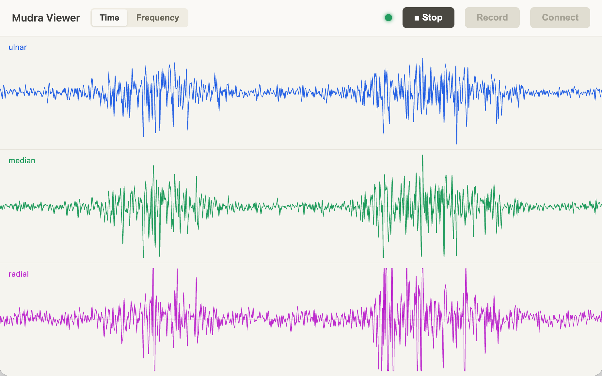
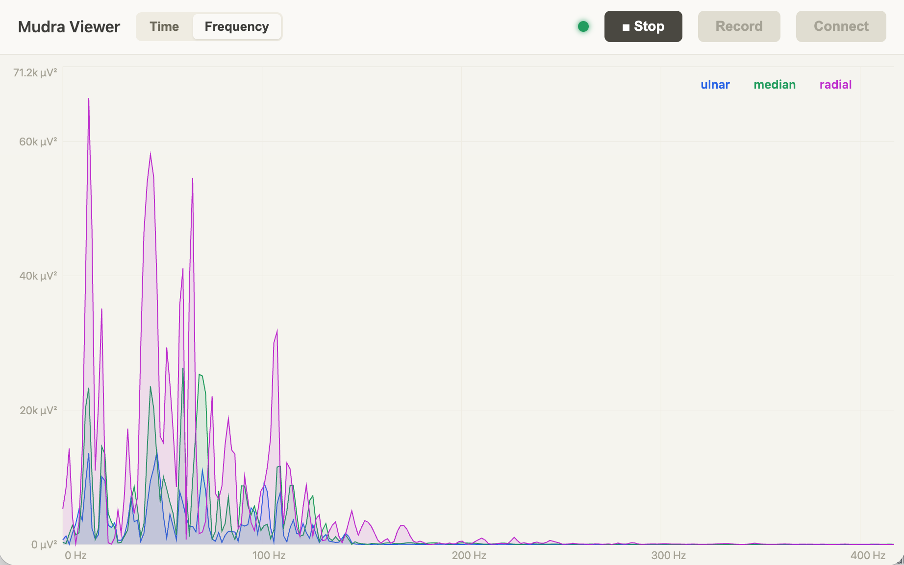

# mudra-viewer

[](https://github.com/ttktjmt/mudra-viewer/actions/workflows/deploy.yml)

Realtime EMG Signal Viewer for Mudra Link

<p align="center">
  <a href="https://ttktjmt.github.io/mudra-viewer"></a>
  <a href="https://ttktjmt.github.io/mudra-viewer"></a>
</p>

<p align="center">
  <em>Check out the app ― <a href="https://ttktjmt.github.io/mudra-viewer/">ttktjmt.github.io/mudra-viewer</a></em>
</p>

A static web app that connects to a Mudra Link directly from the browser over
Web Bluetooth and shows its 3-channel sEMG waveforms in real time (~834 Hz).
Decoding is done by [`mudraka`](https://github.com/ttktjmt/mudraka).

## Browser support

**Chrome / Edge only (desktop and Android).** Safari, Firefox, and iOS do not
support Web Bluetooth and will not work.

## Development

```sh
npm install
npm run dev      # live on http://localhost:5173
npm run build    # tsc + vite build -> dist/
```

Open in supported browser, click **Connect**, pick the device, and the SNC stream starts automatically.
